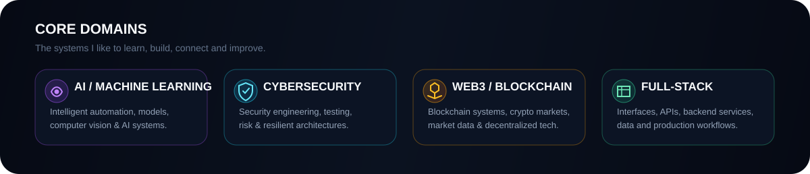

<div align="center">


<br/><br/>

<a href="https://github.com/codebyahda?tab=repositories">
  
</a>


</div>

<br/>

<table>
<tr>
<td width="62%" valign="top">

### 01 / WHO I AM

I'm **Muhammad Ahda Briliantama**, an Information Technology student at **President University** focused on building practical technology across **AI, cybersecurity, software engineering, and emerging Web3 systems**.

I enjoy projects where different domains meet: intelligent automation, secure infrastructure, data-heavy applications, and products that turn complex systems into clean user experiences.

</td>
<td width="38%" valign="top">

### CURRENT SIGNAL

```text
ROLE      Student / Builder
FOCUS     AI + Cyber + Web3
MODE      Build → Test → Improve
INTEREST  Intelligent Systems
          Security Engineering
          Blockchain & Crypto
          Full-Stack Products
```

</td>
</tr>
</table>

<br/>



<br/>

## 02 / SELECTED WORK

<div align="center">

<a href="https://github.com/codebyahda/ML-Powered-Anti-Phishing-and-Spam-Filtering">
  
</a>
<a href="https://github.com/codebyahda/amazon-stock">
  
</a>

<a href="https://github.com/codebyahda/ShadowDarkByte">
  
</a>
<a href="https://github.com/codebyahda/oppa">
  
</a>

</div>

### Security × Machine Learning

The **ML Anti-Phishing & Spam Filtering** project is one of my strongest examples of combining software engineering and cybersecurity: machine-learning classification, anomaly detection, API services, dashboard workflows, and containerized infrastructure.

### Data × Product

The **Amazon Stock Analysis** project explores statistical analysis and visualization through a Streamlit interface, while projects such as **Shadow Dark Byte** and **StreamFlix** reflect my interest in frontend experience and digital product design.

<br/>

## 03 / WEB3 & CRYPTO

<table>
<tr>
<td width="33%" valign="top">

### ⛓️ Blockchain Systems

Learning how decentralized systems structure trust, ownership, transactions, and programmable digital infrastructure.

</td>
<td width="33%" valign="top">

### ₿ Crypto Markets

Interested in crypto-market data, event-driven systems, automation, execution logic, and risk-aware trading infrastructure.

</td>
<td width="33%" valign="top">

### ◈ AI × Web3

Exploring where AI agents, market intelligence, automation, and decentralized technology can work together.

</td>
</tr>
</table>

<div align="center">


</div>

<br/>

## 04 / TOOLBOX

<div align="center">

**Build**


<br/><br/>

**Data & AI**


<br/><br/>

**Security & Systems**


</div>

<br/>

## 05 / GITHUB SIGNAL

<div align="center">


</div>

<br/>

<div align="center">

`AI` · `CYBERSECURITY` · `WEB3` · `BLOCKCHAIN` · `CRYPTO` · `FULL-STACK`

### Build systems that are intelligent, secure, and ready for what comes next.

<sub>codebyahda // learning in public, shipping one system at a time</sub>

</div>
