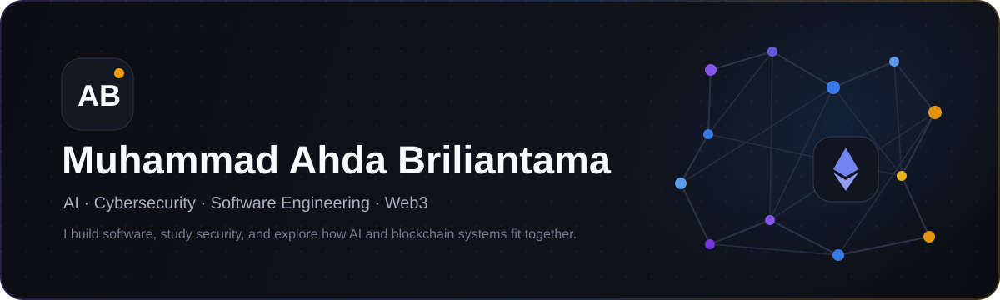
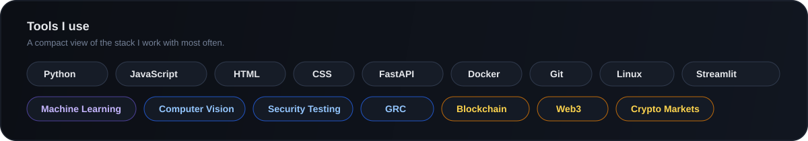

 

**Information Technology student at President University**  
I enjoy building practical software around AI, security, data, and emerging Web3 systems.

[View repositories](https://github.com/codebyahda?tab=repositories)

---

## About me

I'm Ahda. Most of my projects start from a simple question: **can this be made more useful, safer, or easier to understand?**

My main interests are **AI**, **cybersecurity**, and **software engineering**. I also spend time exploring **blockchain and crypto-market systems**, especially the engineering side: market data, automation, execution logic, and how decentralized systems are designed.

I prefer building things that I can test end-to-end rather than stopping at a concept or mockup.

## What I work on

<table>
<tr>
<td width="33%" valign="top">

### AI & data
Machine learning, computer vision, automation, data analysis, and AI-assisted applications.

</td>
<td width="33%" valign="top">

### Security & backend
Security testing, API development, backend services, infrastructure, and GRC-related work.

</td>
<td width="33%" valign="top">

### Web3 & crypto
Blockchain architecture, crypto-market data, trading infrastructure, and experiments around AI × Web3.

</td>
</tr>
</table>

## Selected projects

<table>
<tr>
<td width="50%" valign="top">

### [ML Anti-Phishing & Spam Filtering](https://github.com/codebyahda/ML-Powered-Anti-Phishing-and-Spam-Filtering)

An email-security project that combines machine-learning classification, anomaly detection, API services, a dashboard, and containerized infrastructure.

`Python` `FastAPI` `XGBoost` `Docker` `Security`

</td>
<td width="50%" valign="top">

### [Amazon Stock Analysis](https://github.com/codebyahda/amazon-stock)

A Streamlit project for exploring Amazon stock data through descriptive statistics, probability, visualizations, and normality testing.

`Python` `Pandas` `Streamlit` `Data Analysis`

</td>
</tr>
<tr>
<td width="50%" valign="top">

### [Shadow Dark Byte](https://github.com/codebyahda/ShadowDarkByte)

A cyber-themed landing page where I experimented with visual identity, responsive layout, and interactive frontend presentation.

`HTML` `Tailwind CSS` `JavaScript`

</td>
<td width="50%" valign="top">

### [StreamFlix](https://github.com/codebyahda/oppa)

A streaming-platform frontend concept with navigation, search, notifications, content sections, and responsive UI components.

`HTML` `CSS` `JavaScript`

</td>
</tr>
</table>

## Blockchain & crypto

I'm still developing this side of my portfolio, so I keep the focus on what I'm actually exploring rather than presenting it as finished expertise.

- **Blockchain systems** — understanding decentralized architecture, transactions, ownership, and trust models.
- **Crypto markets** — working with market data, automation, execution rules, and risk-aware system design.
- **AI × Web3** — exploring how agents and automation can interact with market and blockchain infrastructure.

## Stack

## How I like to work

I usually build in small iterations: make it work, test the edge cases, clean up the implementation, then improve the interface. I care about both the technical side and how the final product feels to use.

Right now, the direction I'm most interested in is where **AI, secure software, and programmable financial systems** overlap.

---

**Thanks for stopping by.**

[Browse my repositories →](https://github.com/codebyahda?tab=repositories)

